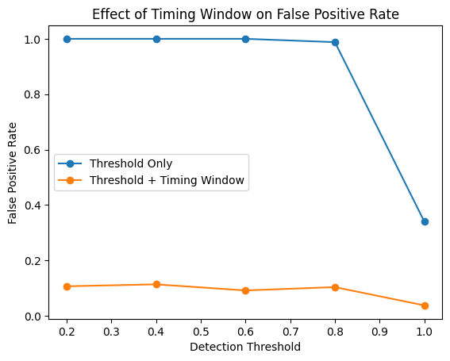

# Detector Signal Analysis and Monte Carlo Simulation

## Project Overview

This project simulates simplified detector-like signals using Python and analyzes how noise, detection thresholds, signal amplitude, and timing-window requirements affect event detection.

The project is inspired by detector-analysis concepts used in particle, nuclear, and rare-event physics experiments.

## Motivation

Rare-event physics experiments often require careful signal analysis because true detector events may be difficult to distinguish from noise or background. This project uses a simplified simulation to explore basic ideas in detector response, event reconstruction, detection efficiency, and false positive rejection.

## Methods

The analysis includes:

- generating Gaussian detector-like pulses
- adding Gaussian noise
- applying threshold-based event detection
- automatically identifying signal peaks
- calculating timing error
- running Monte Carlo simulations
- studying detection efficiency as noise increases
- testing threshold effects for strong and weak signals
- estimating false positive rates using background-only trials
- improving the detection method using a timing-window requirement

## Example Figures

### Simulated Detector Pulse


### Noisy Detector Signal


### Detection Efficiency vs Noise


### False Positive Reduction with Timing Window


## Key Findings

- Increasing noise reduced the precision of event-time reconstruction.
- Strong signals were detected reliably across tested thresholds.
- Weaker signals were more sensitive to threshold choice.
- A threshold-only method produced high false positive rates in background-only trials.
- Adding a timing-window requirement significantly reduced false positives.
- The project demonstrates the tradeoff between sensitivity and selectivity in simplified detector analysis.

## Limitations

This is a simplified educational simulation, not a model of a specific physical detector. Real detector systems may require more detailed modelling of pulse shapes, electronics, calibration, background sources, and detector-specific response functions.

## Future Improvements

Future extensions could include:

- simulating multiple pulses in one time window
- adding background events with random arrival times
- comparing different pulse shapes
- using matched filtering
- studying detection efficiency as both amplitude and noise vary
- adding false negative analysis
- simulating energy-like spectra using pulse amplitudes
- testing more advanced peak-finding algorithms
- exploring coincidence detection

## Tools Used

- Python
- NumPy
- pandas
- Matplotlib
- Jupyter Notebook

## Project Structure

```text
detector-signal-analysis/
├── data/
│   └── README.md
├── figures/
├── notebooks/
│   └── 01_detector_signal_simulation.ipynb
└── README.md