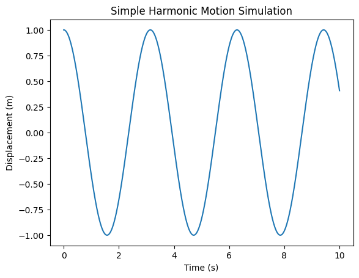
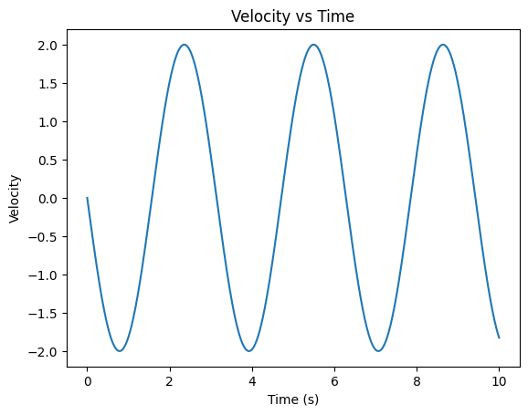
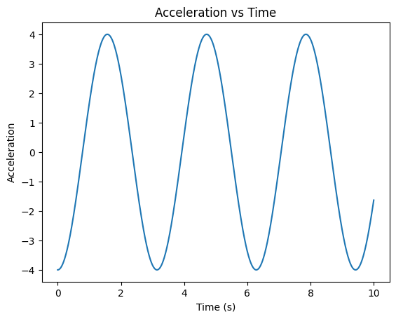
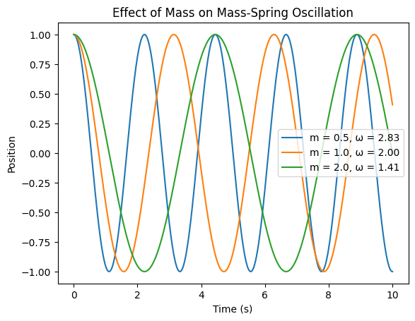
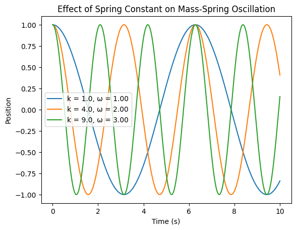
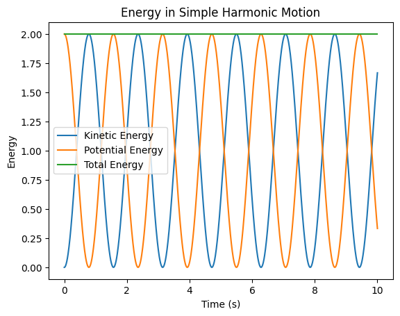
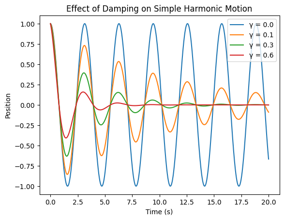

figures/
├── basic_shm_position: 
├── angular_frequency_comparison: 
├── position_velocity_acceleration:   
├── mass_effect: 
├── spring_constant_effect: 
├── energy_conservation: 
├── damping_comparison: 
└── resonance_damping_effect: 