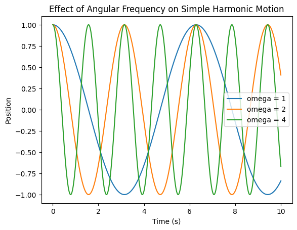
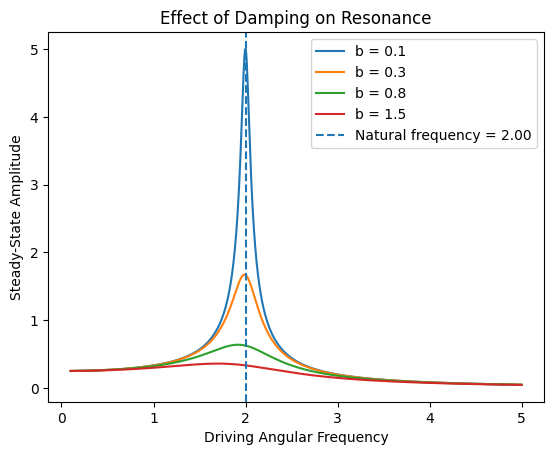

# Modelling Simple Harmonic Motion with Python

## Project Overview

This project models simple harmonic motion using Python simulations and visualizations. It explores how physical parameters such as angular frequency, mass, spring constant, damping, and driving frequency affect the behaviour of an oscillator.

The project begins with ideal simple harmonic motion and builds toward more realistic systems involving damping and driven resonance.

## Motivation

Simple harmonic motion appears throughout physics, from mass-spring systems and pendulums to waves, circuits, molecular vibrations, and resonance phenomena. This project was created to strengthen my understanding of oscillatory motion through computational modelling and visualization.

## Methods

The analysis includes:

- modelling basic simple harmonic motion
- calculating period from angular frequency
- comparing oscillations at different angular frequencies
- plotting position, velocity, and acceleration
- modelling a mass-spring oscillator
- studying the effect of mass and spring constant
- analyzing kinetic, potential, and total mechanical energy
- modelling damped oscillations
- comparing different damping coefficients
- modelling driven oscillations and resonance
- studying how damping affects resonance peaks

## Key Equations

Basic simple harmonic motion:

$$
x(t) = A\cos(\omega t + \phi)
$$

Angular frequency for a mass-spring oscillator:

$$
\omega = \sqrt{\frac{k}{m}}
$$

Period:

$$
T = 2\pi\sqrt{\frac{m}{k}}
$$

Velocity:

$$
v(t) = -A\omega \sin(\omega t + \phi)
$$

Acceleration:

$$
a(t) = -A\omega^2 \cos(\omega t + \phi)
$$

Damped oscillation:

$$
x(t) = Ae^{-\gamma t}\cos(\omega t + \phi)
$$

Driven oscillator amplitude response:

$$
A(\omega_d) = \frac{F_0}{\sqrt{(k - m\omega_d^2)^2 + (b\omega_d)^2}}
$$

## Example Figures

### Basic Simple Harmonic Motion


### Effect of Angular Frequency



### Energy Conservation


### Effect of Damping


### Effect of Damping on Resonance



### Mass-spring animation 


## Key Findings

- Increasing angular frequency causes the oscillator to complete more cycles in the same time interval.
- Increasing mass decreases angular frequency and slows the oscillation.
- Increasing the spring constant increases angular frequency and speeds up the oscillation.
- In an ideal undamped oscillator, kinetic and potential energy exchange over time while total mechanical energy remains constant.
- Damping causes the amplitude of oscillation to decay over time.
- In a driven oscillator, the response amplitude is largest near the natural frequency.
- Increasing damping lowers and broadens the resonance peak.

## Limitations

This project uses simplified mathematical models rather than experimental data. Real oscillatory systems may include nonlinear forces, complicated damping effects, measurement uncertainty, and external disturbances. The driven oscillator model focuses on steady-state amplitude response rather than solving the full differential equation numerically.

## Future Improvements

Future extensions could include:

- solving the oscillator differential equation numerically using `scipy.integrate`
- comparing analytical and numerical solutions
- modelling underdamped, critically damped, and overdamped systems
- adding phase response for driven oscillations
- simulating measurement noise
- applying the model to real experimental oscillator data
- extending the project to coupled oscillators or wave motion

## Tools Used

- Python
- NumPy
- Matplotlib
- Jupyter Notebook
- VS Code

## Project Structure

```text
shm-modelling-project/
├── data/
│   └── README.md
├── figures/
├── notebooks/
│   └── 01_shm_simulation.ipynb
└── README.md